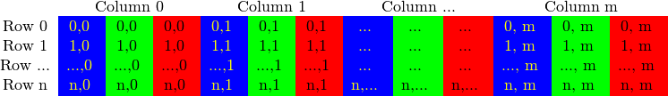

# Mat
## Mat的特点
&emsp;&emsp;不必手动地1.为Mat开辟空间；2.在需要空间时将空间释放；当传递一个已经存在的Mat对象时，开辟好的空间会被重用，并且每次都使用大小正好的内存来完成任务，有点类似于c++中的vector；
## Mat的组成
&emsp;&emsp;Mat由两部分组成：1.矩阵头，用于存储矩阵尺寸、存储地址等信息；2.指向存储所有像素值矩阵的指针；  
&emsp;&emsp;Mat使用引用计数机制：每个Mat对象都有自己的信息头，但共享同一个矩阵；这通过让矩阵指针指向同一地址实现，拷贝构造函数只拷贝信息头和矩阵指针，而不拷贝矩阵,我们可以将其理解为浅拷贝；这样做可以避免拷贝大的图像，降低程序的运行速度；
```c++
Mat A,C;                             //只创建信息头
A = imread(img,CV_LOAD_IMAGE_COLOR); //这里为矩阵分配内存

Mat B(A);
C = A;
```
&emsp;&emsp;在上述代码中，A、B、C改变其中任何一个的矩阵其他两个都会被改变；  
&emsp;&emsp;和shared_ptr使用的引用计数模式一样，Mat会在引用计数为0是清理矩阵；  
&emsp;&emsp;但是在某些情况下，我们也可能向拷贝矩阵本身，那么可以使用下述方式：  
```c++
Mat F = A.clone();
Mat G;
A.copyTo(G);
```
# 像素存储
&emsp;&emsp;颜色空间是指对一个给定的颜色，组合颜色元素以对其进行编码；最简单的颜色空间属于灰度级空间，只处理黑色和白色，对它进行组合可以产生不同程度的灰色；    
&emsp;&emsp;对于彩色，则有不同的颜色空间，包括：RGB、HSV、HLS、YCrCb，其中，RGB是常用的颜色空间，这归功于它也是人眼内部构成颜色的方式；它的基色是红色、绿色、蓝色，有时为了表示透明颜色也会加入第四个颜色alpha(A);  
&emsp;&emsp;针对RGB颜色空间中每一个元素，可以有不同的控制精度，通常情况下，我们使用char类型，占一个字节，范围为0~255；当然，也可以使用float（4字节）、double（8字节），可以更加精细的进行颜色控制；  

# 使用Mat进行像素存储
&emsp;&emsp;Mat本身是一个二维矩阵，和像素分布相同，因此可以用于进行像素存储；
```
Mat M(3,3,CV_8UC3,Scalar(0,0,255));
```
在上述代码中：
* 3，3分别表示该矩阵的行、列数；
* CV_8UC3表示使用8位的 unsigned char 型，每个像素由三个元素组成三通道。
* Scalar 是个short型vector。指定这个能够使用指定的定制化值来初始化矩阵。

# 进行像素遍历
&emsp;&emsp;在图像中，RGB颜色模型的矩阵如下所示：

&emsp;&emsp;很多情况下，因为内存足够大，所以可以实现连续存储，即一行一行的连接起来，形成一个长行，这有助于提升图像扫描速度；我们可以使用isContinuous() 来去判断矩阵是否是连续存储的.
